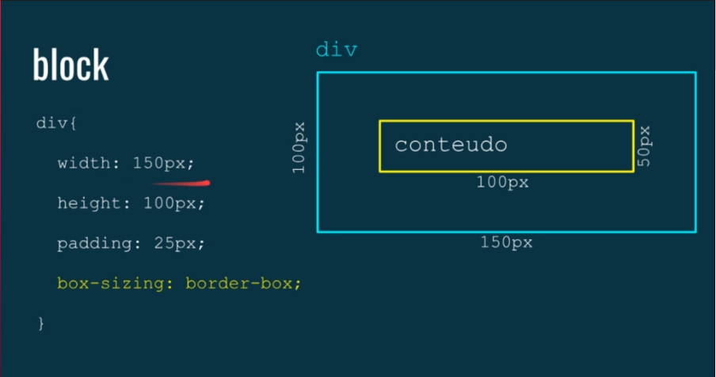

# Box-Sizing (CSS)

Por padrão ele vai somar ao tamanho final do elemento, ou seja, se tenho atribuído 150px/100px(width/height) e faço um padding de 25px, será adicionado 25 para cada lado(cima, baixo, esquerda e direta), ou seja, se tornando, 200px/150px(width/height)

### **É possível manipular isso veja na imagem abaixo:**

### Utilizando esse comando acontecera:

Com esse padding ele vai fazer com que o conteúdo diminua 25px de cada lado, porem, como padding também adiciona 25px de cada lado, basicamente ele vai fazer com que seja preservado os tamanhos padrões de width e height

### Comando completo:

**box-sizing:** Utilizado para alterar a propriedade padrão da box model alterando o tamanho do elemento(conteúdo), usada para calcular larguras(widths) e alturas(heights)

**content-box;** : Usado como padrão, inclui só o conteúdo as medidas de width/height ou seja qualquer margin,border ou padding adicionado sera somado aos valores atribuídos ao mesmos.

**padding-box;** : inclui o padding porem não inclui a propriedade border ou margin, ou seja border e margin(na realidade margin por ser algo de externo nem se conta como somado) serão somados ao width/height

**border-box;** : Inclui padding e border, ou seja, o que atribuirmos como tamanho da div, sera respeitado mesmo adicionando borda e padding
