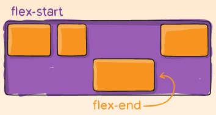

>⚠️ Quanto tiver interação entre coluna e linha, usar CSS Grid.

# 📖 Introdução
O *Flexbox* vem como uma alternativa para organizar os elementos, muito usado para criar o layout da pagina, antigamente se usava uma especie de gambiarra com `float`, porem hoje em dia existe o `flexbox` para resolver os enormes problemas que o `float` trazia.  
O `flexbox` organiza os elementos dentro dele, possibilitando alteração de tamanho sem ter que calcular margin e tudo mais por exemplo, que era um problema passado quando se utilizava `float`, ou seja, todos os *box* dentro de um `flexbox` funcionaram de forma flexíveis e com harmonia.  
  

>🚧 Pode Possuir apenas um ou vários *Flexbox* em seu site, depende de sua imaginação e uso, também sendo possível existir um *Flexbox* **dentro do outro com propriedades distintas**.
>

# ✍ Criando
O `flexbox` necessita de uma elemento, seja ele uma `<div>` ou algo do tipo, para funcionar como o pai de todos os *box*, nele que atribuiremos no *CSS* a propriedade `display:flex;`

>💡 Normalmente esse elemento "Pai de todos" é chamado por meio do atributo `class` de *container*
>


```HTML
<!DOCTYPE html>
<html lang="pt-br">
    <head>
        <meta charset="UTF-8"/>
        <title>Usando Flexbox</title>
        <!-- CSS da Pagina -->
        <style type="text/css">
            .container {
                display:flex;
            }
        </style>
        <!-- Fim do CSS -->
    </head>
    <body>
        <div class="container">
            <div>1</div>
            <div>2</div>
        </div>
    </body>
</html>
```

# 📋 Propriedades Pai (container)
Segui as propriedades possíveis de alterar, que adicionamos ao elemento pai para ter efeito.

## ➡️ Direção
Por padrão o *Flexbox* possui uma direção de **esquerda para direita**, que em código *CSS* é `flex-direction:row;`  
**Possíveis direções:**  
Em linhas, direita para esquerda (Padrão): `row`  
Em linha, esquerda para direita: `row-reverse`  
Em colunas, cima para baixo: `column`  
Em colunas, de baixo para cima: `column-reverse`  


## 📇 Quebra de Linha
Quando atribuímos um tamanho a cima do que cabe, o *Flexbox* tem como prioridade manter todos os elementos na linha, então ele vai redimensionar para que todos caibam na tela, pois por padrão o `flex-wrap` vem setado como `nowrap` ou seja, nao tem quebra de linha.  
  
Sendo possível alterar essa propriedade no CSS, onde temos as opções:
- **nowrap** (Padrão) - Nao quebra a linha
- **wrap** - Quebra a linha e continua na de baixa com a direção setada anteriormente.
- **wrap-reverse** - Quebra a linha e **inverte** a direção setada anteriormente.  


## 🌊 Flow
Através da propriedade `flex-flow` podemos definir a **direção** e o funcionamento da **quebra de linha** juntos, seguindo a sequencia de direção e depois a quebra de linha, ficando da seguinte forma `flex-flow:row wrap;`, **em linha da esquerda para direita com quebra de linha.**

## 🧩 Alinhamento Global
Para alinharmos nossos elementos dentro do *Flexbox* podemos utilizar de duas propriedades, sendo elas:
> ⚠️ Muda de acordo com a direção  
`flex-direction:row;` = `justify-content` Alinhamento horizontal | `align-items` = Alinhamento vertical.  
`flex-direction:column` = `justify-content` Alinhamento vertical | `align-items` = Alinhamento Horizontal.

### 🧰 **`justify-content`**
Adicionamos essa propriedade dentro do *container*  para alinhar na direção que esta sendo exiba, ou seja, que foi definido com `flex-direction`.  
  
Por padrão tem como definição `flex-start`

### 🧰 **`aling-items`**
Adicionamos essa propriedade dentro do *container* alinha na direção contraria definida no `justify-direction`.  
  
Por padrão tem como definição `flex-start`

### 🧰 **`align-content`**
Essa propriedade só tem efeito em *Flexbox* de várias linhas, em que `flex-wrap` é definido como `wrap` ou `wrap-reverse`, Um contêiner flexível de linha única (ou seja, onde `flex-wrap` é definido como seu valor padrão, `no-wrap`) não refletirá `align-conten`
  
Como os anteriores por padrão tem como definição `flex-start`

### 📏 **`gap`**
Através desta propriedade podemos definir manualmente a distancia entre os elementos  
  

#### 👍 Forma Simplificada
Utilizando de forma simplificada `gap` podemos definir em uma o `row-gap` e o `column-gap`

#### 🎯 Forma Especifica
Também podemos adicionar apenas um, ou querer dividir o comando com `row-gap` e `column-gap`

# 📋 Propriedades Filhos
Segui a lista de propriedades que adicionamos nos elementos filhos.

## 🔢 Alterar Ordem dos Elementos
Possível mudar a ordem dos elementos atribuindo ele a propriedade `order` lembrando que todos os elementos por padrão serão definidos por `order:0;`, porem podemos criar uma ordem definindo uma valor de ordem para cada elemento. 
  

> 💡 Importante lembrar que a ordem sera estabelecida de acordo com a direção atribuída!
>

## 📏 `flex-basis`
A propriedade `flex-basis` define o **tamanho inicial dos elementos**, em unidades de pixel, antes que o espaço remanescente seja redistribuído. O valor padrão desta propriedade é `auto`, ou seja por padrão o navegador observa se os itens possuem o mesmo tamanho, Se os elementos não possuírem um tamanho padrão, então as dimensões dos seus conteúdos (imagem, texto, etc) serão passadas como parâmetro para propriedade `flex-basis`. É por isso que quando escreve-se `display:flex` no elemento-pai para criar o contêiner, todos os elementos-filhos se organizam em linha e ocupam apenas o espaço necessário para exibir seu conteúdo.  
> ⚠️ Atribuindo valor 0 a propriedade `flex-basis` independente do conteúdo dimensiona todos de forma igual.

## 📏 `flex-grow`
Com a propriedade `flex-grow` definida como um inteiro positivo, os elementos flex podem crescer ao longo do eixo principal, a partir do valor mínimo estabelecido no `flex-basis`. **Isto fará com que o elemento se estique e ocupe qualquer espaço disponível nesse eixo ou uma proporção dele, caso outros elementos-irmãos também possam crescer.**  
Atribuir o valor 1 à propriedade `flex-grow` fará com que o espaço disponível no contêiner *flex* seja igualmente distribuído entre todos os elementos. Logo, os elementos-filhos irão se expandir para preencher o contêiner no sentido do eixo principal.  
A propriedade flex-grow pode ser empregada para distribuir o espaço proporcionalmente entre os elementos de um contêiner, contudo, se atribuirmos ao primeiro elemento o valor 2, e valor  1 aos elementos restantes, duas partes serão dadas ao primeiro elemento (100px de 200px totais) e uma parte para cada um dos outros dois elementos (50px de 200px totais).  
  

## 📏 `flex-shrink`
Enquanto a propriedade `flex-grow` permite aumentar a largura dos elementos dentro do contêiner para completar o espaço disponível no eixo principal, a propriedade `flex-shrink` **faz o oposto, controlando a redução dos mesmos**. Caso não haja espaço suficiente para acomodar todos os elementos e o valor da propriedade `flex-shrink` seja um inteiro positivo, a largura pode ser reduzida a um valor menor do que a definida na propriedade `flex-basis`. Assim como na propriedade `flex-grow`, diferentes valores podem ser atribuídos a um elemento de modo que ele encolha mais do que os outros - um elemento cuja propriedade `flex-shrink` receba um valor inteiro maior irá diminuir mais do que os seus irmão que tenham valores menores.  
O tamanho mínimo do elemento será levado em consideração ao se calcular a quantidade real de encolhimento que ocorrerá, o que significa que a propriedade `flex-shrink` se comporta de modo potencialmente menos consistente do que a propriedade `flex-grow`.

## 📏 `flex`
As propriedades `flex-grow`, `flex-shrink`, e `flex-basis` **raramente são empregas de forma individual**. Usualmente, elas são combinadas através da propriedade de abreviação **`flex`**. A abreviatura flex permite **definir os três valores** na seguinte ordem: `flex-grow`, `flex-shrink`, `flex-basis`.
```CSS
.item {
    flex: 1 1 auto;
}
```
Há ainda alguns valores de abreviação predefinidos, que cobrem a maioria dos casos de uso. São aplicados com frequência, normalmente, **suprem todas as necessidades práticas**. Os valores predefinidos podem ser vistos abaixo:
- `flex:initial`
- `flex:auto`
- `flex:none`
- `flex:<numero inteiro positivo>`  

> ⚠️ Recomendado utilizar `flex` diretor por ser mais inteligente o funcionamento do quer especificar cada um.
>

`flex:initial` = **reseta os elementos para valores-padrão do Flexbox**, sendo equivale a `flex:0 1 auto` Neste ultimo caso, o valor da propriedade `flex-grow` é 0, então os **elementos não irão crescer mais do que o tamanho-base** definido na propriedade `flex-basis`. o valor da propriedade `flex-shrink` é 1, indicando que o **elemento pode ser reduzido caso seja necessário**, para evitar que o limite do contêiner seja ultrapassado. Por fim, o valor da propriedade `flex-basis` é *auto* e assim será usado o tamanho mínimo necessário para preencher a dimensão do eixo principal.  

`flex:auto` = é equivalente a `flex:1 1 auto`. Essa configuração é semelhante a `flex:initial`, mas nesse caso **os elementos podem aumentar para preencher o contêiner ou diminuir se necessário**, para evitar o transbordamento lateral da tela.  

`flex:none` = irá criar um **elemento flex totalmente inflexível**, sendo o equivalente a escrever `flex:0 0 auto`. O elementos não poderão crescer ou diminuir, mas serão criados usando o *flexbox* com a propriedade `flex-basis` com o valor *auto*.  

Outra abreviação normalmente vista em tutoriais é `flex:1` ou `flex:2` e assim por diante, o que equipara-se a `flex: 1 1 0`. **Os elementos podem crescer ou diminuir a partir da propriedade flex-basis com valor nulo.**

## 🎯 Alinhamento Especifico
Pode ser alterado o alinhamento de um único *box* com a propriedade `align-self`  


# *Links* importantes
caniuse.com
https://github.com/philipwalton/flexbugs

