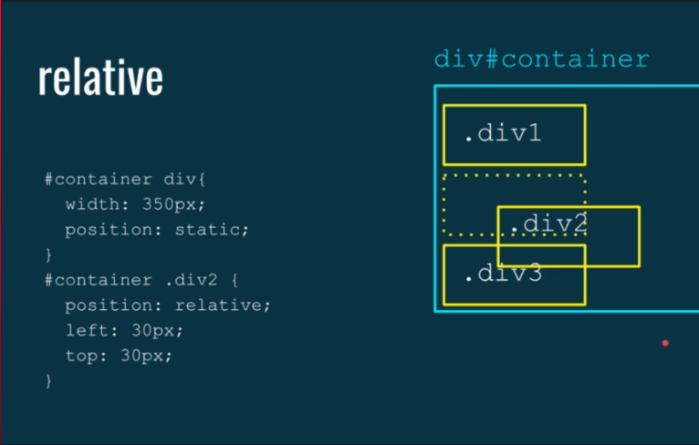

# Introdução

É basicamente uma forma de posicionar determinado elemento, em determinado local especifico da tela, normalmente o HTML e CSS lidam com uma determinada forma de exibição.

Com o position conseguimos colocar uma propriedade CSS especifica em um item especifico em que esse item pode mudar de posição, podemos manipular isto com os tipos de position diferente.

# Como posicionar:

Para posicionar os nossos elementos **depois que escolhemos qual tipo de position** será aplicado.

`top: 10px;` : Distancia 10px em relação ao topo total

`right: 10px;` : Distancia 10px em relação a direita total

`left: 10px;` : Distancia 10px em relação a esquerda total.

`bottom: 10px;` Distancia 10px em relação a base total.

Primeiro ele cola onde atribuímos, exemplo, right, ele vai colar a direta ao máximo, e ai o valor que adicionarmos ele vai distanciar indo pra outra direção.

# `z-index`
Utilizando essa propriedade em elementos posicionados podemos manipular em qual camada ou seja o eixo Z, se encontra, assim podendo definir quem fica na frente de quem, por padrão todos possuem `z-index` igual a 0.

## *Static* (padrão)

Os elementos posicionados estáticos não são afetados pelas propriedades top, bottom, left e right.

Um elemento com `position:static` não está posicionado de forma especial, está sempre posicionado de acordo com o fluxo normal da página


## *Relative*

Um elemento com `position:relative` está posicionado em relação à sua posição normal, criando um novo contexto, assim sobrepondo os elementos do contexto padrão.

Definir as propriedades top, right, bottom, left de um elemento relativamente posicionado fará com que ele seja ajustado para longe de sua posição normal.

> ⚠️ Outro conteúdo não será ajustado para caber em qualquer lacuna deixada pelo elemento.

### Exemplo `Relative` 1


### Exemplo `relative` 2



## Absolute
Um elemento com `position: absolute;` cria um novo contexto deixando sua posição anterior vaga, e se posicionado em relação ao ancestral posicionado mais próximo, ou seja, seu ancestral mais próximo na hierarquia(pai, avo) e que esteja posicionado, ou seja não possua o position padrão que é static e sim alguma das outra formas de position.

Se um elemento posicionado de forma absoluta não tiver ancestrais posicionados, ele usará o corpo do documento como base, colando na barra de rolagem para se posicionar, porem caso não tenha nenhuma propriedade de posicionamento (top, right, left, bottom) ele ficara posicionado em relação ao elemento antes dele, e caso a gente insira uma propriedade de posicionamento ele ira mudar para se posicionar de acordo com o documento.

Elementos posicionados absolutos são removidos do fluxo normal e podem sobrepor elementos.

### Posicionando no Centro
Existe uma técnica para posicionar um elemento no centro, utilizando em conjunto a propriedade `transform`
```CSS
div {
    position: absolute;
    left: 50%;
    transform: translateX(-50%); /* Menos pois estamos movendo para o lado esquerdo*/
}
```
A `transform` com o valor `translate` ele pega 50% do tamanho do elemento, diferente do `position` que pega da tela toda.  
Necessário esse procedimento pois o ponto de referencia de um elemento e a sua borda esquerda, assim ele nao fica perfeitamente alinhado ao meio quando atribuímos o valor 50% para o position, assim pela logica se tirar 50% do tamanho do elemento para o outro lado ficara no centro, e isto que fizemos com `transform`.

Podemos escrever o `translateX()` especifico como no código, ou o simplificado, que na ordem iremos atribuir um valor a X depois um valor para Y `translate(x,y)`

### Ancestral sem position (static)
Como não possui ancestral posicionado, a nossa .div2 sai do fluxo padrão, e começa a flutuar, caso não tivesse propriedade de posicionamento, ela ficaria voando colada na div1, porem como foi adicionado top e right, nossa div2 foi se posicionar em relação ao documento.


### Ancestral com position.


Primeiro não podemos esquecer que com absolute o elemento sai do fluxo padrão, e ficara posicionado perto do elemento mais próximo ate adicionarmos propriedade de posicionamento, adicionando qualquer uma delas (top, right, left, bottom) nosso absolute vai buscar sua referencia para se posicionar, Como nosso ancestral no caso div#container possui um posicionamento que no caso é relative, o absolute vai se posicionar em relação ao seu ancestral, ou seja, dentro dele.

## Fixed

Um elemento com `position:fixed` cria um novo contexto deixando sua posição anterior vaga, está posicionado em relação à janela de visualização, o que significa que sempre permanece no mesmo lugar, mesmo se a página for rolada. As propriedades top, right, bottom e left são usadas para posicionar o elemento.

Um elemento fixo não deixa uma lacuna na página onde normalmente estaria localizado.


## Sticky

Um elemento com `position: sticky;` é posicionado com base na posição de rolagem do usuário.

Um elemento que alterna entre relativo e fixo, dependendo da posição da barra de rolagem. ou seja, ele é posicionado em relação até que uma determinada posição de deslocamento seja encontrada na janela de exibição então, ele "se fixa" no lugar.

Importante : O Internet Explorer não oferece suporte para posicionamento fixo. O Safari requer um prefixo -webkit-  `position: -webkit-sticky;`. Você também deve especificar pelo menos uma propriedade top, right, bottom e left para que o posicionamento fixo funcione.