# Tipos referencia vs Tipos valor

## **Classes sao tipos referencia**

Variáveis cujo tipo sao classes nao dever ser entendidas como caixas, mas sim "tentáculos" (ponteiros) para caixas.

Variáveis do programa sao alocadas dentro da parte ***stack*** da memoria, quando criamos um objeto, ele e alocado na parte ***Heap*** da memoria e deixa um endereço (tentáculo, ponteiro) para localizar na parte ***stack***

No *Heap* sao alocados os objetos em tempo de execução, **Isso e chamado de alocação dinâmica de memoria**

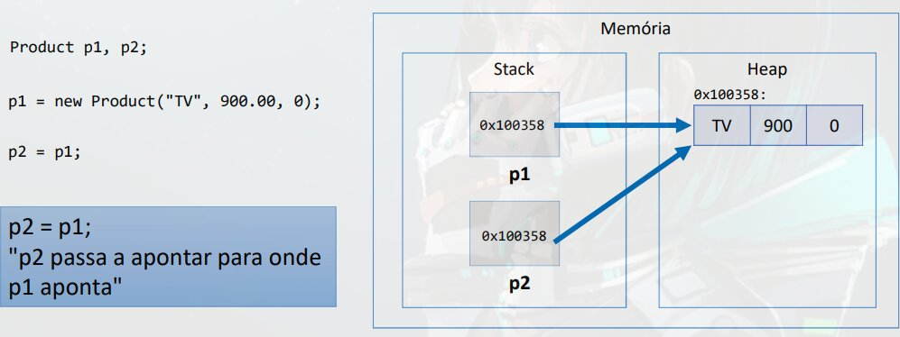

### Valor "null"

Tipos referencia aceitam o valor "null", que indica que a variável aponta para ninguém.


## Tipos primitivos sao tipos valor

Em Java, tipos primitivos sao tipos valor. Tipos valor sao **CAIXAS** e nao ponteiros, ou seja, ficão alocados diretamente no ***stack***


### Os Tipos Primitivos

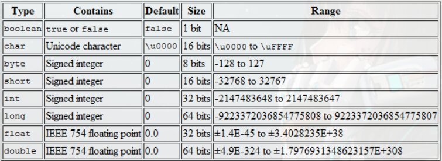

### Tipos primitivos e Inicialização

```java
int p;
System.out.println(p); // erro: Variável nao iniciada

p = 10;
System.out.println(p);
```

## Valores Padrão

Quando alocamos (new) qualquer tipo estruturado (classe ou array), sao atribuídos valores padrão aos seus elementos.
- Números: 0
- Boolean: false
- char: caractere código 0
- object: null

# Comparação

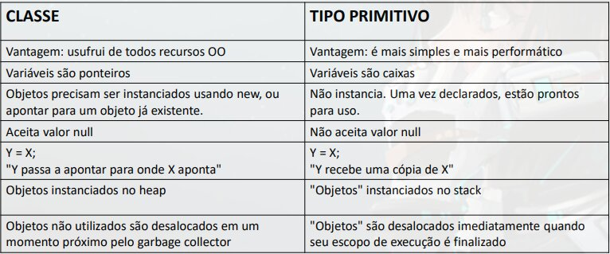
- OO: Orientação a Objeto.
- Garbage Collector: Verifica o ***heap*** e desaloca objects que nao estão sendo mais utilizados.
    
# Desalocação de Memoria - Garbage Collector e Escopo Local

## Garbage Collector

- E um processo que **automatiza o gerenciamento de memoria** de um programa em execução
- O garbage collector **monitora** os objetos **alocados dinamicamente pelo programa (no heap)**, desalocando aqueles que nao estão mais sendo utilizados.

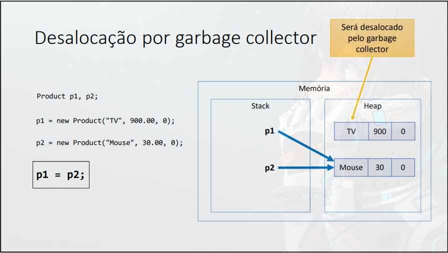

> Um objeto sem referencia sera desalocado pelo garbage collector.

## Desalocação por Escopo

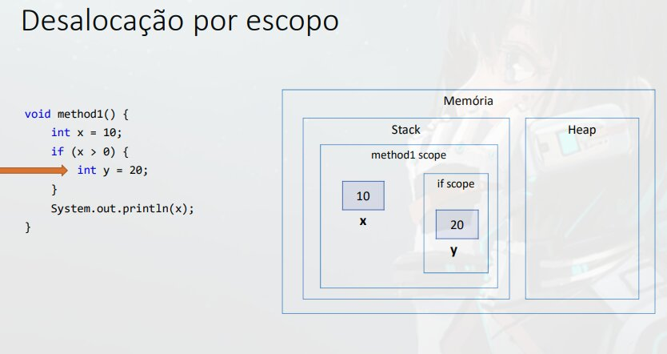
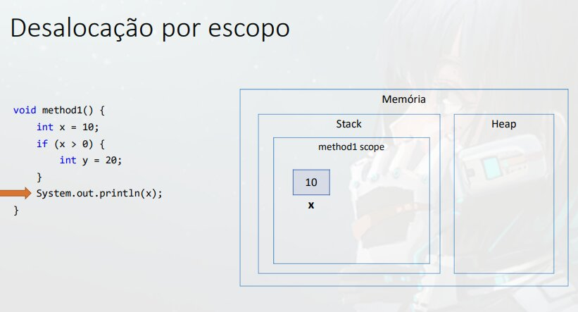
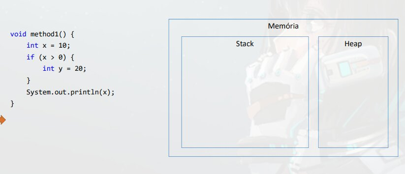

### Outro Exemplo

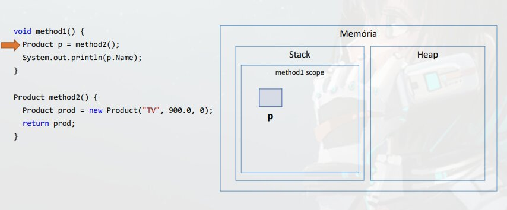
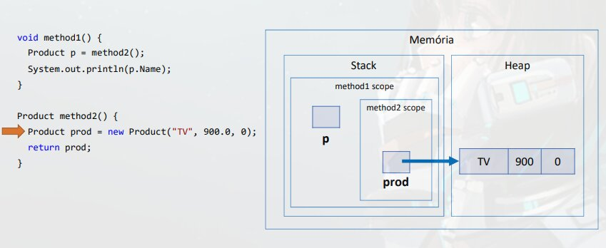
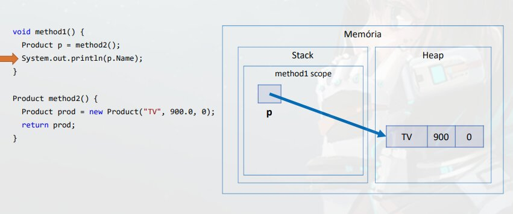

## Resumo

- **Objetos alocados dinamicamente**, quando **nao possuem** mais **referencia** para eles, **serão desalocados pelo garbage collector**
- **Variáveis Locais** sao desalocadas **imediatamente** assim que seu **escopo local sai de execução**

# Vetor

- Sera aprendido
    - Declaração e instanciação
    - Manipulação de vetor dee elementos tipo valor (tipo primitivo)
    - Manipulação de vetor de elementos tipo referencia (classe)
    - Acessos aos elementos
    - Propriedade `length`

> **Em programação, "vetor" e o nome dado a arranjos unidimensionais**

- **Arranjo (Array)** e uma estrutura de dados:
    - Homogênea (dados do mesmo tipo)
    - Ordenada (Elementos acessados por meio de posição)
    - Alocada de uma vez so, em um **bloco contíguo de memoria**

- Vantagens
    - **Acesso imediato** aos elementos **pela** sua **posição**
- Desvantagens
    - **Tamanho Fixo**
    - **Dificuldade** para se realizar **inserções e deleções**

## Problema Exemplo
Fazer um programa para ler um numero inteiro N e a altura de N pessoas. Armazene as N alturas em um vetor. Em seguida, mostrar a altura media dessas pessoas.
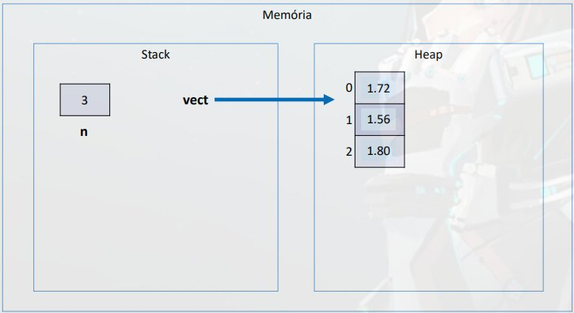
```java
package application;

import java.util.Locale;
import java.util.Scanner;

public class Program {
    public static void main(String[] args) {
        Locale.setDefault(Locale.US);
        Scanner sc = new Scanner(System.in);

        int n = sc.nextInt();
        double[] vect = new double[n];

        for (int i=0; i<n; i++) {
            vect[i] = sc.nextDouble();
        }
        
        double sum = 0.0;
        for(int i=0; i<n; i++) {
            sum += vect[1];
        }
        
        double avg = sum / n;
        

        System.out.printf("AVERAGE HEIGHT: %.2f%n", avg);

        sc.close();
    }
}
```
> Colchetes indica que e um vetor `double[]`.
>
> Em seguida a variável recebe a **instanciação do vetor** `new double[tamanho do vetor]`
>
> Lembrando que double e o **tipo**

## Problema Exemplo 2
Fazer um programa para ler um numero inteiro N e os dados (Nome e Preço) de N produtos. Armazene os N produtos em um vetor. Em seguida, mostrar o preço médio dos produtos.
```java
// Classe Product
package entities;

import java.util.Locale;
import java.util.Scanner;

public class Product {
    private String name;
    private Double price;

    public Product(String name, double price) {
        this.name = name;
        this.price = price;
    }
    public String getName() {
        return name;
    }
    public void setName(String name) {
        this.name = name;
    }
    public double getPrice() {
        return price;
    }
    public void setPrice(double price) {
        this.price = price;
    }
}

// Classe Program
package application;

import java.util.Locale;
import java.util.Scanner;

import entities.Product;

public class Program {
    public static void main(String[] args) {
        Locale.setDefault(Locale.US);
        Scanner sc = new Scanner(System.in);

        int n = sc.nextInt();
        Product[] vect = new Product[n];
        
        for (int i=0; i<n; i++) {
            sc.nextLine();
            String name = sc.nextLine();
            double prince = sc.nextDouble();
            vect[i] = new Product(name, price);
        }
        
        double sum = 0.0

        for(int i=0; i<n; i++) {
        // Acessando o vetor na posição `i` e somando o valor pegando o preço.
            sum += vect[i].getPrice();
        }
        
        double avg = sum / n;
        System.out.printf("AVERAGE PRICE = %.2f%n", avg);

        sc.close();
    }
}
```

Ao criar um vetor **tipo referencia**, e criado um vetor no *heap* com os campos com valor `null` (Ponteiros vazios).
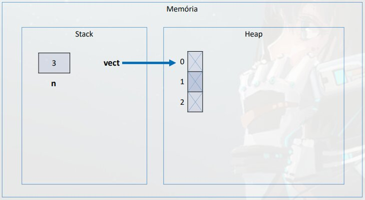

Para **armazenar um produto** (Product que criamos) na posição 0 (Primeira posição do Vetor) **sera necessário instanciar** um produto e fazer a posição 0 **apontar para um produto**.

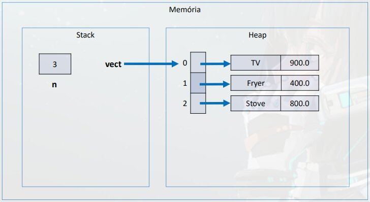

- **Cada campo do vetor e uma referencia**

## length

**Todo vetor** tem o `length` uma forma de **receber o tamanho do vetor**, ou seja podemos substituir o uso da variável `n` nos *loops* e usar o `length`:
```java
for (int i=0; i<vect.length; i++) {
    // Bloco de Código
}
```

# Exercício de Fixação
A dona de um pensionato possui dez quartos para alugar para estudantes, sendo esses quartos identificados pelos números 0 a 9.  
Fazer um programa que inicie com todos os dez quartos vazios, e depois leia uma quantidade N representando o numero de estudantes, que vao alugar quartos (N pode ser de 1 a 10). Em seguida, registre o aluguel dos N estudantes. Para cada registro de aluguel, informar o nome e email do estudante, bem como qual dos quartos ele escolheu (de 0 a 9). Suponha que seja escolhido um quarto vago. Ao final, seu programa deve imprimir um relatório de todas ocupações do pensionato, por ordem de quarto/ conforme exemplo.
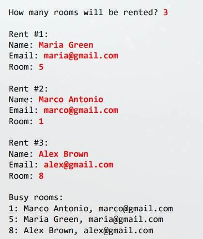