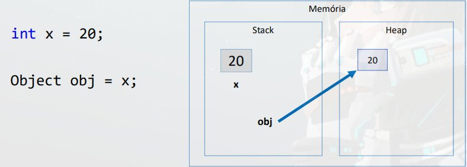
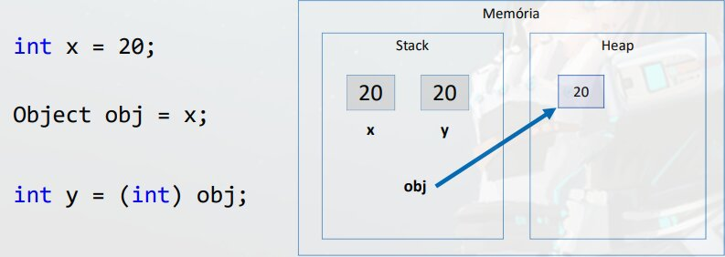
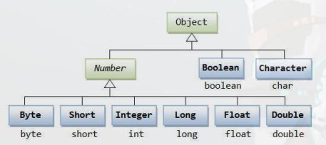

# Boxing

E um processo de **conversão de um objeto tipo valor** para um **objeto tipo referencia compatível**.



- **`Object`** - E uma classe, a classe object e a classe mais Genérica do *Java*, **todas as classes por padrão sao filhas da Classe `object`**

Pegamos o tipo valor, e encaixotamos (boxing) ele em um object

# Unboxing

E um processo de **conversão de um objeto referencia** para um **objeto tipo valor compatível**.



# Wrapper Classes

- Sao classes equivalentes aos tipos primitivos
> *Java* tem essa particularidade, para cada tipo primitivo, tem também um tipo classe que e compatível com esse tipo.
- Boxing e Unboxing e natural na linguagem
> No exemplo assim tivemos que fazer um *casting* para o compilador aceitar o inteiro `int y = (int) obj`
>
> Usando esses Wrapper nao sera necessário o *casting* (Suponto que o `obj` e da classe `Integer`) `Int y = obj`
- Uso comum: Campos de entidades em sistemas de informação (IMPORTANTE!)
    - Pois tipos referencia (classes) **aceitam valor null** e usufruem dos recursos OO (Orientação Objeto)
    ```java
    public class Product {
        public String name;
        public Double price;
        public Integer quantity;
        
        (...)
    }
    ```
    > Exemplo um campo para o usuário inserir uma data, e ele e opcional, e bom ser um *Wrapper* para poder usar do valor `null`, pois e comum em banco de dados ter alguns campos que podem valer `null`.


> Como podemos ver para cada tipo primitivo, tem um tipo classe com a primeira letra maiúscula.