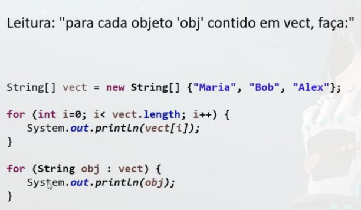

# laço "for each"
Sintaxe opcional e simplificada para percorre coleções que e o "for each"

# Sintaxe
```java
for (tipo apelido : coleção) {
    // Bloco de Comandos
}
```
> Percorre toda a coleção, chamando cada elemento pelo `apelido` que escolhemos para referencia-lo 
> Tipo = Tipo dos Elementos do vetor.

# Exemplo
```java
package application;

public class Program {
    public static void main(String[] args) {
        // Instancia um vetor com 3 posições que serão as atribuídas a frete.
        String[] vect = new String[] {"Maria", "Bob", "Alex"};
        
        // Forma usada anteriormente
        for (int i=0; i<vect.length; i++) {
            System.out.println(vect[i]);
        }
        
        // Usando laço `for each`
            // Percorre todos os elementos do `vect` guardando um por vez no `obj`
        for (String obj : vect) {
            Sustem.out.println(obj);
        }
    }
}
```

