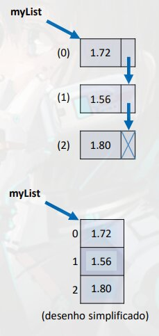

# Sera aprendido

- Conceito de lista
- Tipo `List` - Declaração, instanciação
- Referencia: <https://docs.oracle.com/javase/10/docs/api/java/util/List.html> 
- Assuntos pendentes:
    - Interfaces
    - generics
    - predicados (lambda)
    
# Lista

> Exemplo de lista encadeada.
>
> Encadeada por cada nó (ou nodo) aponta para o proximo item da lista, ate que o ultimo possua um valor `null` ou algo para indicar que e o ultimo.


- Lista e uma estrutura de dados:
    - Homogênea (dados do mesmo tipo)
    - Ordenada (Elementos acessados por meio de posição)
    - Inicia vazia, e seus elementos sao alocados sob demanda
    - Cada elemento ocupa um "nó" (ou nodo) da lista
> Cada item da lista carrega um valor e um nó (ou nodo), que e a referencia (um ponteiro) para o proximo valor.
    
- Tipo (interface): List
> `List` nao e uma classe, e sim uma **interface**
>
> Interface = Um tipo que defini apenas a especificação das operações, para trabalhar com objeto deste tipo teremos que instancias, porem a interface nao pode ser instanciada, vamos precisar de uma classe que implementar esta interface
- Classes que implementam: ArrayList, LinkedList, etc.

- Vantagens:
    - **Tamanho variável**
    - **Facilidade** para se realizar **inserções e deleções**
- Desvantagens:
    - **Acesso sequencial aos elementos**
        - Dependendo da implementação da lista essa navegação e otimizada.

## Importante

- Tamanho da lista:
    - `size()`
- Inserir elementos na lista:
    - `add(obj)`
    - `add(int, obj)`
- Remover elementos da lista:
    - `remove(obj)`
    - `remove(int)`
    - `removeIf(Predicate)`
- Encontrar posição de elemento:
    - `indexOf(obj)`
    - `lastIndexOf(obj)`
- Filtrar lista com base em Predicado:
    - `List<Integer> result = list.stream().filter(x -> x > 4).collect(Collectors.toList());`
- Encontrar primeira ocorrência com base em predicado:
    - `Integer result = list.stream().filter(x -> x > 4).findFirst().orElse(null);`


**Lista diferente de vetor nao aceita tipos primitivos**

```java
package application;

// ATENÇÃO AOS IMPORT
import java.util.ArrayList;
import java.util.List;

public class Program {
    public static void main(String[] args) {

        List<int> list; // erro: nao aceita tipos primitivos

        List<Integer> list; // Aceita a wrapper class do int.
        
        List<Integer> list = new ArrayList<Integer>(); // versões mais recentes do Java, nao e necessário adicionar Wrapper class também na instanciação
    }
}
```

- <...> - Generics, quando voce pode parametrizar a definição de um tipo, informando um outro tipo especifico que voce quiser.
- `List<Integer> list;` - Essa simples declaração nao permite o uso da lista, e necessário instanciar a lista.
- `new ArrayList();` Instanciando a `List`, como `List` e uma interface temos que usar uma classe que implemente essa interface, no caso usamos a `ArrayList`
    - Classe `ArrayList` e interessante pois pega as melhores coisas do Vetor e trás para as Listas.
    
Parou  no min 4:18