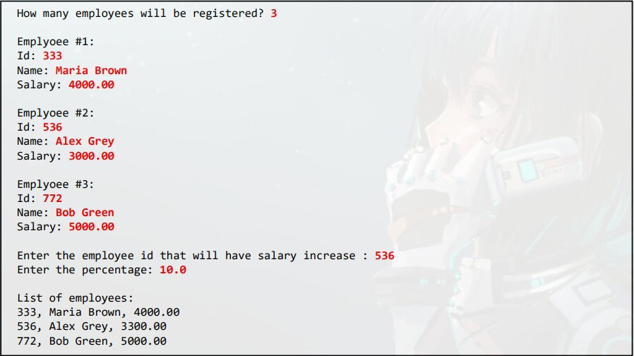
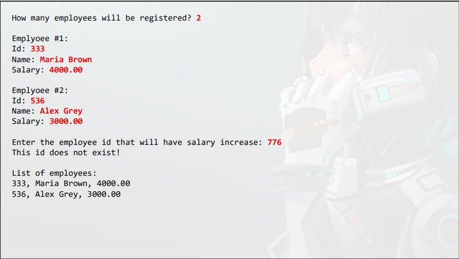

# Sera aprendido

- Conceito de lista
- Tipo `List` - Declaração, instanciação
- Referencia: <https://docs.oracle.com/javase/10/docs/api/java/util/List.html> 
- Assuntos pendentes:
    - Interfaces
    - generics
    - predicados (lambda)
    
# Lista

> Exemplo de lista encadeada.
>
> Encadeada por cada nó (ou nodo) aponta para o proximo item da lista, ate que o ultimo possua um valor `null` ou algo para indicar que e o ultimo.


- Lista e uma estrutura de dados:
    - Homogênea (dados do mesmo tipo)
    - Ordenada (Elementos acessados por meio de posição)
    - Inicia vazia, e seus elementos sao alocados sob demanda
    - Cada elemento ocupa um "nó" (ou nodo) da lista
> Cada item da lista carrega um valor e um nó (ou nodo), que e a referencia (um ponteiro) para o proximo valor.
    
- Tipo (interface): List
> `List` nao e uma classe, e sim uma **interface**
>
> Interface = Um tipo que defini apenas a especificação das operações, para trabalhar com objeto deste tipo teremos que instancias, porem a interface nao pode ser instanciada, vamos precisar de uma classe que implementar esta interface
- Classes que implementam: ArrayList, LinkedList, etc.

- Vantagens:
    - **Tamanho variável**
    - **Facilidade** para se realizar **inserções e deleções**
- Desvantagens:
    - **Acesso sequencial aos elementos**
        - Dependendo da implementação da lista essa navegação e otimizada.

## Importante

- Tamanho da lista:
    - `size()`
- Inserir elementos na lista:
    - `add(obj)`
    - `add(int, obj)`
- Remover elementos da lista:
    - `remove(obj)`
    - `remove(int)`
    - `removeIf(Predicate)`
- Encontrar posição de elemento:
    - `indexOf(obj)`
    - `lastIndexOf(obj)`
- Filtrar lista com base em Predicado:
    - `List<Integer> result = list.stream().filter(x -> x > 4).collect(Collectors.toList());`
- Encontrar primeira ocorrência com base em predicado:
    - `Integer result = list.stream().filter(x -> x > 4).findFirst().orElse(null);`


**Lista diferente de vetor nao aceita tipos primitivos**

```java
package application;

// ATENÇÃO AOS IMPORT
import java.util.ArrayList;
import java.util.List;

public class Program {
    public static void main(String[] args) {

        List<int> list; // erro: nao aceita tipos primitivos

        List<Integer> list; // Aceita a wrapper class do int.
        
        List<String> list = new ArrayList<String>(); // versões mais recentes do Java, nao e necessário adicionar Wrapper class também na instanciação
        list.add("Maria");
        list.add("Jose");
        list.add("Antonio");
        list.add("Marta");
        list.add("Jasinto");
        list.add(2, "Marco"); // Usando o `add` com sobrecarga informando a posição
        
        System.out.println(list.size()); // Exibe o tamanho da lista
        

        for (String x : list) {
            System.out.println(x);
        }
        System.out.println("--------------------------");
        list.remove("Marta"); // Removendo a partir da compradão de valor
        list.remove(1); // Removendo a partir da posição
        list.removeIf(x -> x.charAt(0) == 'M'); // Removendo item a partir de um predicado. (Estamos usando uma função lambda)
        for (String x : list) {
            System.out.println(x);
        }
        System.out.println("--------------------------");
        System.out.println("Index of Maria" + list.indexOf("Maria")); // Exibira a posição do item na lista.
        System.out.println("Index of Mauricio" + list.indexOf("Mauricio")); // Retornara -1 pois nao existe na lista
        System.out.println("--------------------------");
        List<String> result = list.stream().filter(x -> x.charAt(0) == 'J').collect(collectors.toList());
        for (String x : result) {
            System.out.println(x);
        }
    }
}
```

- <...> - Generics, quando voce pode parametrizar a definição de um tipo, informando um outro tipo especifico que voce quiser.
- `List<Integer> list;` - Essa simples declaração nao permite o uso da lista, e necessário instanciar a lista.
- `new ArrayList();` Instanciando a `List`, como `List` e uma interface temos que usar uma classe que implemente essa interface, no caso usamos a `ArrayList`
    - Classe `ArrayList` e interessante pois pega as melhores coisas do Vetor e trás para as Listas.
- `indexOf` - retorna -1 quando nao encontra item na lista.
- `removeIf`- podemos usar predicados para remover varis itens de uma vez.
- `remove` - Possível remover item a partir de comparação de valor e também por posição na lista.

# Filtrando matando resultado apenas com o predicado.

Criamos uma `List<String>` (Lista do tipo *String*) para receber o resultado.  
Pegamos a nossa *list* transformamos em um tipo `stream` (Tipo especial a partir do Java 8+ que aceita operações com funções lambda), a partir do `stream` usaremos a função `filter` com um **predicado** onde selecionamos os começados com letras 'J', assim este `filter` devolvera um `stream` filtrado conforme o **predicado**, **Porem `stream` nao e compatível com `List`, ou seja, sera necessário converter para `List`, então usamos a função `collect` com o parâmetro `collectors.toList()`
> Fica bastante verboso porem foi a forma que o *Java* encontrou para manter a compatibilidade com o `List` que e um tipo antigo e permitir que faca operações de lambda com `List`.
```java
List<String> result = list.stream().filter(x -> x.charAt(0) == 'J').collect(collectors.toList());
```

# Como encontrar um elementos que atenda um certo **predicado** 

```java
package application;

import java.util.ArrayList;
import java.util.List;

public class Program {
    public static void main(String[] args) {
        List<String> list;
        list<String> = new ArrayList<>()
        
        list.add("Alex");
        list.add("Bob");
        list.add("Anna");
        
        String name = list.stream().filter(x -> x.charAt(0) == 'A').findFirst().orElse(null);
        System.out.println(name);
    }
}
```

- `findFirst` - Pegara o primeiro elementos do `stream` porem ele retorna um Optional String, este tipo Optional também e do Java 8+.
- `orElse(null)` - Se este elemento nao existir retornara `null`

# Exercícios de Fixação

Fazer um programa para ler um número inteiro N e depois os dados (id, nome e salario) de N funcionários. Não deve haver repetição de id.  

Em seguida, efetuar o aumento de X por cento no salário de um determinado funcionário. Para isso, o programa deve ler um id e o valor X. Se o id informado não existir, mostrar uma mensagem e abortar a operação. Ao final, mostrar a listagem atualizada dos funcionários, conforme exemplos.  

Lembre-se de aplicar a técnica de encapsulamento para não permitir que o salário possa ser mudado livremente. Um salário só pode ser aumentado com base em uma operação de aumento por porcentagem dada. 



**Correção:** <https://www.youtube.com/watch?v=Xj-osdBe3TE>