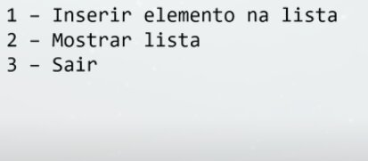

# Agenda Lista Encadeada (Estrutura de Dados)

- Motivação
- **A linguagem nao importa**
- Conceitos
- Introdução pratica
> Estrutura de dados muito importante para encontrar o meio mais performático, extremamente importante tal conhecimento

## Lista Encadeada

- Uma das primeiras Estruturas de Dados baseadas em nós geralmente sao estudadas.
- E uma estrutura de dados que armazena os valores em uma sequencia de nós.
- Cada nó conhece seu nó sucessor (ou antecessor se for uma lista duplamente encadeada)
- Tem-se a noção de posição nas listas
- Conceitos:
    - Cabeça : Primeiro elemento da lista
    - Cauda: Lista sem o primeiro elemento
- Complexidade:
    - Busca: O(N)
        - Por ser uma sequencia de nós, necessário percorrer item a item, ate chegar no desejado.
    - Inserção: Depende
    - Remoção: Depende
    - Dependa da implementação da lista para saber inserção e remoção
> Normalmente e traduzido como nó ou nodo, pois vem do ingles node.
- Lista encadeada resumido - Cada item tem um valor e um ponteiro para o proximo valor, onde apenas o ultimo nao aponta para ninguém, ou seja, seu espaço do ponteiro possui um valor `null`.

## Exemplo de uso

Fazer um programa que atenda ao menu:


## Solução
```java
// Classe Program
package app;
import java.util.Scanner;
import java.util.Locale;
public class Program {
    public static void main(String[] args) {
        Locale.setDefault(Locale.US);
        Scanner sc = new Scanner(System.in);
        // Menu
        int op;
        do {
            showMenu();
            op = sc.nextInt();
            switch (op) {
                case 1: {

                    break;
                }
                case 2: {

                    break;
                }
                case 3: {
                    System.out.println("Fim do programa");
                    break;
                }
                default: {
                    System.out.println("Opção invalida!");
                    break;
                }
            }
        }while (op != 3);
        // Encerra Scanner
        sc.close();
    }
    public static void showMenu() {
        System.out.println("1 - Inserir elemento da lista");
        System.out.println("2 - Mostar lista");
        System.out.println("3 - Sair");
    }
}
```

---

# Agenda Generics

- Por que Generics?
- Exemplo Básico: Lista simples encadeada
- Spring Boot
    - **Service genérico**
    - Bonus:
        - Wildcard types
        - Interface com implementação default
        
## Generics

- Comum em linguagens com **tipagem estática** onde criamos um tipo e parametrizamos o tipo.
    - `List<Product> list;` - Lista parametrizada com tipo `Product`, ou seja, parametrizando com tipo especifico.
- Se usa *Generics* por causa do ***Type-Safety***(Segurança de Tipo).

## Exemplo Básico

Sera usado um código de Lista simples encadeada (Estudado anteriormente), onde o seu tipo e *Double*(A lista por padrão no seu código so trabalha com tipo *Double*), a idia do *Generics* e poder usar e mesmo código e criar uma lista Genérica de outro tipo sem que seja necessário mudar o Código da lista.

### Iniciando Lista de forma padrão

> Atenção essa `List` e um **Classe criado por nos**, o ***Java*** tem seu `List` que e uma interface, ou seja, nao aceita ser instanciada, [mais sobre](./26-listas.md).
>
> Código do canal no [Nelio Alves](https://www.youtube.com/watch?v=XuR756Q37bk)
```java
List list = new List();

list.add(3.5);      // Aceita
list.add(9.2);      // Aceita
list.add("Maria");  // Nao aceita
```

## Parametrizando com *Generics*

Caso a linguagem nao suporta-se *Generics* seria necessário mudar o código da Classe `List`  
Sera usado o mesmo código da Classe `List` porem usaremos um ***Generics*** para ser compatível com outro tipo de valores.  

Para que a classe aceite *Generics* na frente de seu nome colocaremos os sinais `<T>` com um parâmetro "T" para se referir ao tipo que sera ali inserido, no caso usei a letra "T" para se referir a "Tipo".
> Código do canal no [Nelio Alves](https://www.youtube.com/watch?v=XuR756Q37bk)
```java
// Dentro do código da Classe
public class Node<T> {
    private T value;
    private Node<T> next;

    public T getValue() {
        return value;
    }
    public void setValue(T value) {
        this.value = value;
    }
    public Node<T> getNext() {
        return next;
    }
    public void setNext(Node<T> next) {
        this.next = next;
    }
}
// Dentro do código da Classe
public class List<T> {
    private Node<T> head;

    public void add(T value) {
        Node<T> node = new Node<T>();
        node.setValue(value);
        node.setNext(head);
        head = node;
    }
    
    @Override
    public String toString() {
        StringBuffer sb = new StringBuffer();
        sb.append("[");

        Node<T> p = head;

        while (p != null) {
            sb.append(p.getValue() + " ");
            p = p.getNext();
        }
        
        sb.append("]");
        return sb.toString();
    }
}

// Dentro da Classe Program no Void Main

List<Double> list = new List<Double>(); // Lista so aceita Double.
list.add(3.5);
list.add("Maria"); // Nao aceita.
```
Uma forma **antigamente usada** para fazer o mesmo que o *Generics*, era **usar um tipo mais genérico**, como vimos em [Wrapper Class](./24-boxingUnboxingWrapper.md) onde o tipo `Number`, usando o conceito de **Herança** e o pai dos tipos numéricos, se ele e o pai ele carrega as características que sao passadas a eles, ou seja, **aceita todos os tipos de números.**, e aprofundando mais temps o tipo **`Object`** pai de todos os tipos, ou seja, aceita qualquer tipo.

> **Importante ressaltar** que se o tipo e `Object` ou seja heterogêneo aceita qualquer tipo, **nao tera uma propriedade muito importante** que e o ***Type-Safety***, ou seja, **nao garante que manterá seu tipo original**, assim **podendo causar erro em tempo de execução**, onde o programa pode quebrar, onde para driblar esse risco começa a ocorrer muita gambiarra no código, ou seja, usar *Generics* trás mas segurança

## [Aula](https://www.youtube.com/watch?v=XuR756Q37bk&t=2168s&ab_channel=DevSuperior) continua usando Spring Boot 