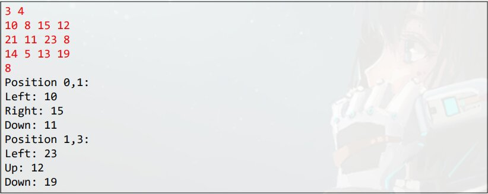

# Espera-se que:

- Declaração e instanciação
- Acesso aos elementos / como percorrer uma matriz
- Propriedade length

# Matriz

- Em Programação, "Matriz" e o nome dado a **arranjos bidimensionais**
    - **Atenção:** ***"vetor de vetores"***
- Arranjo (Array) **e uma estrutura de dados:**
    - Homogêneo (Dados do mesmo tipo)
    - Ordenado (Elementos acessados por meio de posição)
    - Alocada de uma vez so, em um bloco contíguo de memoria
- **Vantagens:**
    - Acesso imediato aos elementos pela sua posição
- **Desvantagens:**
    - Tamanho fixo
    - Dificuldade para se realizar inserções e deleções
    

> Por exemplo o valor 7.5 esta na localização 1,2, Linha 1 Coluna 2, por padrão e lido esta forma, primeiro a linha depois a coluna. 

# Exercício Resolvido

Fazer um programa para ler um numero inteiro N e uma matriz de ordem N contendo números inteiros. Em seguida, mostra a diagonal principal e a quantidade de valores negativos da matriz.
> Ordem N quer dizer que vai ter N linhas e N colunas

## Exemplo de Funcionamento


# Sintaxe
- `[][]` - Informa que e um arranjo bidimensional
- `[][][]` - Informa que e um arranjo tridimensional
```java
// Instanciando a Matriz
int n = 3;
int[][] mat = new int[n][n];

// Percorrendo Matriz e adicionando valores
for (int i=0; i<n; i++) {
    for (int j=0; j<n; j++) {
        mat[i][j] = sc.nextInt();
    }
}
```
> Instanciando uma matriz com 3 Linhas e 3 Colunas


> Podemos usar `length` para receber o valor do tamanho da matriz, usando a matriz acima com nome `mat` ficaria `mat.length` assim exibira a **quantidade de linhas** para exibir a **quantidade de colunas** usaremos dentro de um `for` percorrendo as linhas ficaria `mat[i].length`.  
> **Exemplo para facilitar intentamento:**
```java
for (int i=0; i<mat.length; i++) {
    for (int j=0; j<mat[i].length; j++) {
        // Código
    }
}
```

# Exercício de Fixação

Fazer um programa para ler dois números inteiros M e N, e depois ler uma matriz de M linhas por N colunas contendo números inteiros podendo haver repetição. Em seguida, ler um numero inteiro X que pertence a matriz. Para cada ocorrência de X, mostrar os valores a esquerda, acima, a direita e abaixo de X, quando houver, conforme exemplo.

