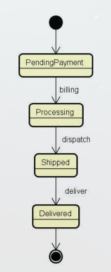
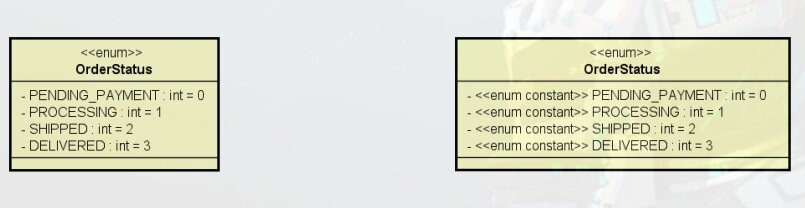

# Espera-se que:
- Definição / discussão
- Exemplo: estados de um pedido
- Conversão de string para enum
- Representação UML

# Enumerações

- E um tipo especial que serve para **especificar de forma literal** um **conjunto de constantes relacionadas**
- Palavra chave em Java: ***enum***
- Vantagem: **Melhor semântica**, código mais legível e **auxiliado pelo compilador**.
- Doc: <https://docs.oracle.com/javase/tutorial/java/javaOO/enum.html>

# Exemplo

Ciclo de vida de um pedido, sao os estados que o pedido passa do inicio ao fim, para ficar se com a semântica boa e facilitar para o programador usa-se **enumeração**



> Diagrama de maquina de estado, UML

## Declarando enumeração

```java
package entities.enums;

public enum OrderStatus {
    PENDING_PAYMENT,
    PROCESSING,
    SHIPPED,
    DELIVERED;
}
```

Definimos os valores específicos para um status de pedido, com a enumeração em mãos podemos criar uma classe pedido, que tem como atributo o status
```java
package entities;

import java.util.Date;

import entities.enums.OderStatus;

public class Order {
    private Integer id;
    private Date moment;
    private OrderStatus status;

    (...)
}
```

> Por padrão o java transformara para string um `enum` com o mesmo nome que ele possui.

# Conversão de `String` para `enum`

Importantes pois uma aplicação que usar o `enum` ela vai pedir para o usuário entrar com um valor para o `enum`, e o usuário entrara com o dado na forma de `String`, por exemplo em um formulário, assim pegaremos esse dado em formato `String` e converteremos para `enum`
```java
OrderStatus os1 = OrderStatus.DELIVERED;
OrderStatus os2 = OrderStatus.valueOf("DELIVERED");
```

# Notação UML para `enum`

E o mesmo da classe um retângulo divido em 3, porem no nome do tipo incluiremos um esteriótipo informando que ele e um `enum`, e na sessão so meio colocamos os valores que queremos para este tipo enumerado.



> Modelo de domínio

Inclusive na primeira versão informamos que cada valor do `enum` vai corresponder a um numero inteiro.  
Ao lado direito temos um **notação alternativa** que adiciona um esteriótipo a cada valor enumerado, indicando que sera um valor constando do tipo enumerado.
