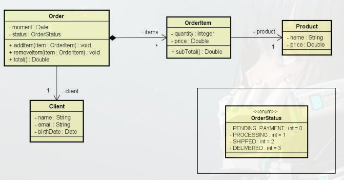

# Categorias de classes

- Em um sistema orientado a objetos, de modo geral "tudo" e objeto.
- Por questões de design tais como organização, flexibilidade, reuso, delegação, etc., ha varias categorias de classes:

    - Views - Telas do sistema
    - Controllers - Controladores, faz o meio de campo entre a tela e o sistema
    - Entities - Entidades de negócios como produtos, pedidos e assim por diante
    - Services - Representam serviços
    - Repositories - Classes que representam repositórios, objetos responsáveis por acessar dados de um banco de dados.
    
# Exemplo **Entities**

Diagrama que tem um pedido (Order) que esse pedido tem items do pedido (OrderItem) cada item de pedido esta associado a um produto (Product) o pedido ainda esta associado ao cliente (Client), ou seja temos varias entidades (Entities) de negocio associadas entre si, representando o domínio do sistema

# Exemplo **Services**

Por exemplo podemos ter um serviço de pedidos (OrderService) responsável por salvar (save) e pesquisar serviços (search), onde este serviço de pedidos, pode estar relacionado com um repositório de pedido, onde este repositório de pedidos estará responsável por fazer operações com banco de dados (CrudRepository), onde nosso serviço de pedido pode estar relacionado com um serviço de email (EmailService) que tem a respondibilidade de enviar emails, da mesma forma um serviço de autenticação (AuthService) pode precisar do serviço de email, assim havendo um reuso do serviço de email (EmailService)