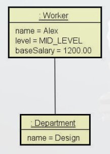

# Composição

- E um tipo de associação que permite que um objeto contenha outro
- Relação "tem-um" ou "tem-vários"
- **Vantagens**
    - Organização: Divisão de repensabilidade
    - Coesão: Cada objeto e responsável por uma única coisa, responsabilidade simples e bem definida.
    - Flexibilidade: Divido em partes se torna mais flexível do que um todo muito grade.
    - Reuso: O mesmo objeto pode ser reaproveitado em mais de um lugar.
- **Nota:** Embora o simbolo UML para composição (toda-parte) seja o diamante preto, neste contexto estamos chamando de composição **qualquer associação tipo "tem-um" e "tem-vários".**

# Exemplo


A seta partindo `Order` para `OrderItem` esta indicando a relação de composição, uma `Order` (possui um asterisco perto da ponta, que significa, vários) ou seja, uma `Ordem` contem vários items.  
Na ***UML*** o simbolo de composição e o diamante preto sendo que a classe que estiver do lado do diamante preto neste caso o `Order` ele e o **lado do todo** e o outro lado sera o **lado das partes**, ou seja, informamos que o pedido (Order) e o todo e os items dos pedidos (OrderItem) sao as partes  
Este sendo uma relação de composição todo parte entre objetos.

Ja a relação entre o pedido (Order) e o cliente (Client), nao possui o diamante preto, pois nao e uma relação de todo parte, o cliente (Client) nao e parte do pedido (Order), mas ele esta associado com o pedido (Order), a seta indica que um pedido tem um cliente, nao e uma relação todo parte, porem mesmo assim chamamos de composição de objetos, pos na hora de implementar dentro do objeto pedido tera um atributo do tipo client (Client), chamamos de composição de objetos.

Porem vare enfatizar que o **diamante preto** e usado em uma relação de todo parte

A composição de objetos pode ocorrer nao somente com entidades (Entities), por exemplo pode ocorrer também com serviços

# Exercício Resolvido

Ler os dados de um trabalhador com N contratos (N fornecido pelo usuário). Depois, solicitar do usuário um mes e mostrar qual foi o salario do funcionário nesse mes, conforme exemplo.


## Exemplo de uso


- Começo a construir das bordas para dentro, em sequencia `Department`, `HourContract`, `WorkerLevel` e por ultimo `Worker`
- Temos **um departamento** (Department) para cada trabalhador (Worker) e **vários contratos** por hora (HourContract) para cada trabalhador.
    - Como o trabalhador tem vários contratos, esse vários sera representado como uma lista.
- Quando possuímos um "tem muitos" que no caso sera uma Lista (List) nao incluímos no construtor, iniciamos ela vazia.
- Remove o `setContracts` pois ele esta recebendo como parametro uma nova lista (List) de trocando pela nossa lista atual de contratos e isso nao pode acontecer.
- `income` o seja o quanto que ganho, no caso passando como parâmetro o mes mais o ano, retornada o salario base mais a some do que ele recebeu dos contratos daquele mes.
```java
public Double income(int year, int month) {
double sum = baseSalary;
Calendar cal = Calendar.getInstance();
for (HourContract c : contracts) {
    cal.setTime(c.getDate()); // Defini a data do calendário, como a data do contrato.
    int c_year = cal.get(Calendar.YEAR);
    int c_month = 1 + cal.get(Calendar.MONTH);  // +1 pois o mes inicia como 0 (janeiro)
    if (year == c_year && month == c_month) {
        sum += c.totalValue();
    }
}
return sum;
}
```
> Adiciona a soma (sum) o salario base (baseSalary), criado um forEach para percorrer a lista onde tera um `if` para averiguar se o contrado que se encontra no loop no momento, ou seja, o contrato armazenado em `c` tem o mesmo mes e ano passados como parâmetro para o método, para averiguarmos essa comparação sera necessário ter acesso ao mes e ano dentro do objeto `Date` que usaremos u `Calendar` para tal, guardando estes valores em variáveis temporárias para comparação no if.
- Como o departamento (Department) e outro objeto, ou seja, e uma composição de objetos, entao tera que instanciar um departamento (Department) passando o nome que informamos e ai sim fazemos a associação.
- `Worker worker = new Worker(workerName, WorkerLevel.valueOf(workerLevel), baseSalary, new Department(departmentName));` - Instanciamos um novo objeto do tipo `Worker` os dados deste objeto sao:
    - `workerName` - Nome do trabalhador de digitamos
    - `WorkerLevel.valueOf(workerLevel)` - Uma instancia de `WorkerLevel` no valor que digitamos
    - `baseSalary` - O Salario base que foi digitado
    - Associado a este objeto, tera outro objeto do tipo `Department` e o nome deste departamento sera o nome que digitamos para `departmentName`
- Na memoria ficara da seguinte forma (Diagrama de objetos, representa os objetos na memoria)
    - 
- Apos criar o `for` para instanciar os contratos e associar os contratos com o trabalhador, na memoria sera criado os objetos de contrato sendo eles associados ao trabalhador (worker) por exemplo:
    - 
    
# Exercício resolvido 2 (Usando **`StringBuilder`**)

Instancia manualmente (hard code) os objetos mostrados abaixo e mostre-os na tela do terminal, conforme o exemplo:

## Diagram UML


## Saida


- Começa pela programação do `Comment`
- Assim como no exercício anterior Remove o `setComments` pois ele esta recebendo como parâmetro uma nova lista (List) e trocando pela nossa lista atual de comentários isso nao pode acontecer, para adicionar e remover comentarios na nossa lista, adicionamos os **métodos** `addComment` e `removeComment`
    - **Quando e uma coleção lista, nao se faz metodo `set` e sim `add` e `remove`**
- Possível entender a importância do StringBuilder quando for desenvolver o `toString` da classe `Post`, pois com concatenação de Strings o Programa ficara muito pesado e o `StringBuilder` e otimizado para esta solução, ou seja, montar um ***String*** grande a partir de vários outros ***Strings*** pequenos.

# Exercício de Fixação

Ler os dados de um pedido com N itens (N fornecido pelo usuário). Depois, mostrar um sumario do pedido conforme exemplo (proxima pagina). Nota: O instante do pedido deve ser o instante do sistema: `new Date()`

## Diagrama UML


## Exemplo Funcionamento


## Instanciar os objetos na memoria da seguinte forma:

