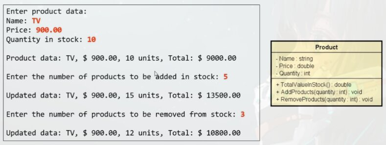

# Construtores

- E uma operação especial da classe, que executa no momento da instanciação do objeto
- Usos comuns:
    - Iniciar valores dos atributos
    - Permitir ou obrigar que o objeto receba dados / dependências no momento de sua instanciação (Injeção de dependências)
- Se um construtor customizado nao for especificado, a classe disponibiliza o construtor padrão:
    - `Product p = new Product()` - Ja utilizamos antes, quanto chamamos `new Product()` este `Product()` e um construtor padrão, ou seja, mesmo que nao especificarmos um construtor personalizado, a classe ja tem por padrão um construtor embutido nela.
- E **possível** especificar **mais de um construtor na mesma classe (Sobrecarga)**

## Problema Exemplo


### Solução Anterior
```java
// Classe Product
package entities;

public class Product {
    public String name;
    public double price;
    public int quantity;
    public double totalValueInStock() {
    return price * quantity;
    }
    public void addProducts(int quantity) {
        this.quantity += quantity;
    }
    public void removeProducts(int quantity) {
        this.quantity -= quantity;
    }
    public String toString() {
    return name
        + ", $ "
        + String.format("%.2f", price)
        + ", "
        + quantity
        + " units, Total: $ "
        + String.format("%.2f", totalValueInStock());
    }
}

// Classe Program
package application;

import java.util.Locale;
import java.util.Scanner;
import entities.Product;

public class Program {
    public static void main(String[] args) {
    Locale.setDefault(Locale.US);
        Scanner sc = new Scanner(System.in);
        Product product = new Product();
        
        System.out.println("Enter product data: ");
        System.out.print("Name: ");
        product.name = sc.nextLine();
        System.out.print("Price: ");
        product.price = sc.nextDouble();
        System.out.print("Quantity in stock: ");
        product.quantity = sc.nextInt();
        System.out.println();
        System.out.println("Product data: " + product);
        System.out.println();
        System.out.print("Enter the number of products to be added in stock: ");
        int quantity = sc.nextInt();
        product.addProducts(quantity);
        
        System.out.println();
        System.out.println("Updated data: " + product);

        System.out.println();
        System.out.print("Enter the number of products to be removed from stock: ");
        quantity = sc.nextInt();
        product.removeProducts(quantity);
        
        System.out.println();
        System.out.println("Updated data: " + product);
        
        sc.close();
    }
}
```
### Proposta de melhoria

Quando executamos o comando abaixo, instanciamos um produto "product" com seus atributos "vazios":


- Variáveis quando instanciadas em um *object* ou *Array*, elas **recebem um valor padrão**.
    - name: `String` - Classe
    - price: `double` - Dado primitivo, numero com ponto flutuante.
    - quantity: `int` - Dado primitivo, numero inteiro.

Com intuito de **evitar a existência de produtos sem nome e sem preço** (Utilizando o valor padrão), e possível fazer com que seja **"Obrigatório" a iniciação desses valores, utilizando um Construtor.**
> Normalmente se coloca um construtor depois dos atributos antes dos métodos.

```java
// Classe Product
package entities;

public class Product {
    public String name;
    public double price;
    public int quantity;

    public Product(String name, double price, int quantity) {
        this.name = name;
        this.price = price;
        this quantity = quantity;
    }

    public double totalValueInStock() {
    return price * quantity;
    }
    public void addProducts(int quantity) {
        this.quantity += quantity;
    }
    public void removeProducts(int quantity) {
        this.quantity -= quantity;
    }
    public String toString() {
    return name
        + ", $ "
        + String.format("%.2f", price)
        + ", "
        + quantity
        + " units, Total: $ "
        + String.format("%.2f", totalValueInStock());
    }
}

// Classe Program
package application;

import java.util.Locale;
import java.util.Scanner;
import entities.Product;

public class Program {
    public static void main(String[] args) {
        Locale.setDefault(Locale.US);
        Scanner sc = new Scanner(System.in);
        
        System.out.println("Enter product data: ");
        System.out.print("Name: ");
        String name = sc.nextLine();
        System.out.print("Price: ");
        double price = sc.nextDouble();
        System.out.print("Quantity in stock: ");
        int quantity = sc.nextInt();
        
        Product product = new Product(name, price, quantity);

        System.out.println();
        System.out.println("Product data: " + product);

        System.out.println();
        System.out.print("Enter the number of products to be added in stock: ");
        quantity = sc.nextInt();
        product.addProducts(quantity);
        
        System.out.println();
        System.out.println("Updated data: " + product);

        System.out.println();
        System.out.print("Enter the number of products to be removed from stock: ");
        quantity = sc.nextInt();
        product.removeProducts(quantity);
        
        System.out.println();
        System.out.println("Updated data: " + product);
        
        sc.close();
    }
}
```
Podemos observar que o construtor e parecido com um método comum so nao possui o tipo de retorno, porem ele se inicia no momento da instanciação do objeto.  
Como nossa classe tem o nome de *Product* o construtor e declarado da seguinte forma `public Product() {}`  
Por convenção utilizamos os mesmos nomes nos parâmetros, mas vale lembrar  que para parâmetro nao precisa ser o mesmo nome.  
`this` referencia para o próprio *object*.  
Criado variáveis para receber os dados e depois passar para o construtor.

# Palavra `this`

> Usamos para diferenciar o atributo do objeto, do parâmetro do construtor

- E uma referencia para o próprio objeto
- Uso comuns:
    - Diferenciar atributos de variáveis locais
    - Passar o próprio objeto como argumento na chamada dee um método ou construtor
    
## Uso ja conhecido
```java
package entities;

public class Product {
    public String name;
    public double price;
    public int quantity;

    public Product(String name, double price, int quantity) {
        this.name = name;
        this.price = price;
        this.quantity = quantity;
    }
}
```

## Passar o próprio objeto como argumento
**Na chamada de um Metodo ou construtor.**
```java
public class ChessMatch {
    (...)
    placeNewPiece('e', 1, new King(board, Color.WHITE, this));
    (...)
}
```
Criamos uma classe de jogo de xadrez onde dentro do método `placeNewPiece`, dentro deste método sera passado como parâmetro a própria partida, usando a palavra `this`

# Sobrecarga

E um recurso que uma classe possui de oferecer mais de uma operação com o mesmo nome, porem com diferentes listas de parâmetros.

## Proposta de melhoria

- Vamos criar um construtor opcional, o qual recebe apenas nome e preço de produto, A quantidade em estoque este novo produto, por padrão, devera entra ser iniciado com o valor zero.
- Nota: E possível também incluir um construtor padrão.
> Sobrecarga disponibilizar mais de uma versão de uma mesma operação

```java
package entities;

public class Product {
    public String name;
    public double price;
    public int quantity;

    public Product() {} // Mantendo construtor padrão

    // Sobrecarga 1
    public Product(String name, double price, int quantity) {
        this.name = name;
        this.price = price;
        this.quantity = quantity;
    }
    // Sobrecarga 2
        public Product(String name, double price) {
        this.name = name;
        this.price = price;
    }
}
```

# Encapsulamento

- E um principio que consiste em **esconder detalhes de implementação de uma classe**, expondo apenas operações seguras e que mantenham os objetos em um estado consistente.
- **Regra de ouro:** O objeto deve sempre estar em um estado consistente, e a própria classe deve garantir isso.

## Regra geral básica

- Um objeto **NAO** deve expor nenhum atributo (Modicador de acesso **private**)
- Os atributos devem ser acessados por meio de métodos *get* e *set*
    - Padrão JavaBeans: <https://en.wikipedia.org/wiki/JavaBeans>
    
## Padrão para implementação de *getters* e *setters*
Supondo de possuímos a classe *Product* e essa classe possui os atributos `name` e `price`, usando `private` informamos que esses atributos nao podem ser acessados por outras classes.
> Por convenção esses métodos sao colocados depois dos construtores
>
> Se necessário adicionar mais código, esse e o padrão
>
> `quantity` so poderá se alterar pelos métodos de adicionar ou remover no stock, ou seja, para `quantity` so teremos o *get*.

```java
private String name;
private double price;

public String getName() {
    return name;
}

public void setName(String name) {
    this.name = name;
}

public double getPrice() {
    return price;
}

public void setPrice(double price) {
    this.price = price;
}
```

## Proposta de melhoria
```java
package entities;

public class Product {
    private String name;
    private double price;
    private int quantity;

    public Product() {
    }

    public Product(String name, double price, int quantity) {
        this.name = name;
        this.price = price;
        this.quantity = quantity;
    }

    public Product(String name, double price) {
        this.name = name;
        this.price = price;
    }

    public String getName() {
        return name;
    }

    public void setName(String name) {
        this.name = name;
    }

    public double getPrice() {
        return price;
    }

    public void setPrice(double price) {
        this.price = price;
    }

    public int getQuantity() {
        return quantity;
    }
    (...)
```