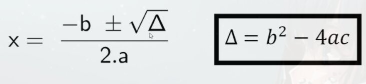

# Introdução

Algumas funções matemáticas em *Java*  
Exemplo | Significado
--- | ---
`A = Math.sqrt(x);` | Variavel A recebe a **raiz quadrada** de x
`A = Math.pow(x, y);` | Variavel A recebe o resultado de x **elevado** a y
`A = Math.abs(x);` | Variavel A recebe o valor **absoluto** de x
> java.lang.Math para encontrar lista com todas as funções

# Incluindo funções em expressões maiores.



```java
delta = Math.pow(b, 20) - 4*a*c;

x1 = (-b + Math.sqrt(delta)) / (2.0 * a);
x2 = (-b - Math.sqrt(delta)) / (2.0 * a);
```