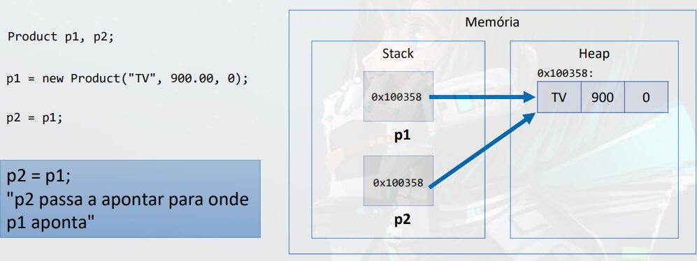
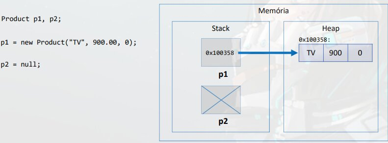
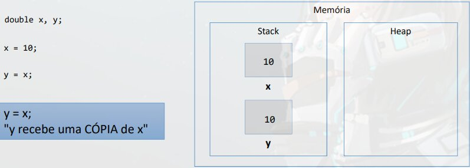
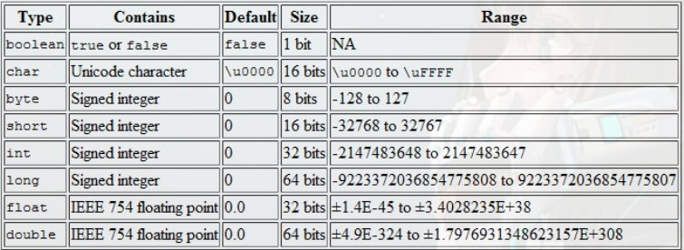
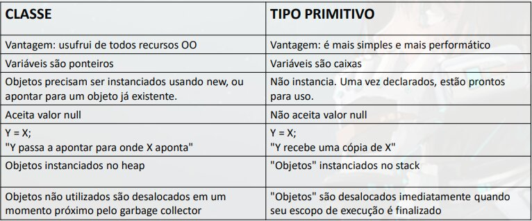

# Tipos referencia vs Tipos valor

## **Classes sao tipos referencia**

Variáveis cujo tipo sao classes nao dever ser entendidas como caixas, mas sim "tentáculos" (ponteiros) para caixas.

Variáveis do programa sao alocadas dentro da parte ***stack*** da memoria, quando criamos um objeto, ele e alocado na parte ***Heap*** da memoria e deixa um endereço (tentáculo, ponteiro) para localizar na parte ***stack***

No *Heap* sao alocados os objetos em tempo de execução, **Isso e chamado de alocação dinâmica de memoria**



### Valor "null"

Tipos referencia aceitam o valor "null", que indica que a variável aponta para ninguém.



## Tipos primitivos sao tipos valor

Em Java, tipos primitivos sao tipos valor. Tipos valor sao **CAIXAS** e nao ponteiros, ou seja, ficão alocados diretamente no ***stack***



### Os Tipos Primitivos



### Tipos primitivos e Inicialização

```java
int p;
System.out.println(p); // erro: Variável nao iniciada

p = 10;
System.out.println(p);
```

## Valores Padrão

Quando alocamos (new) qualquer tipo estruturado (classe ou array), sao atribuídos valores padrão aos seus elementos.
- Números: 0
- Boolean: false
- char: caractere código 0
- object: null

# Comparação


    - OO = Orientação a Objeto.
    - Garbage Collector = Verifica o ***heap*** e desaloca objects que nao estão sendo mais utilizados.