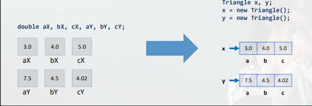
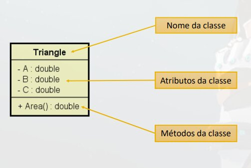
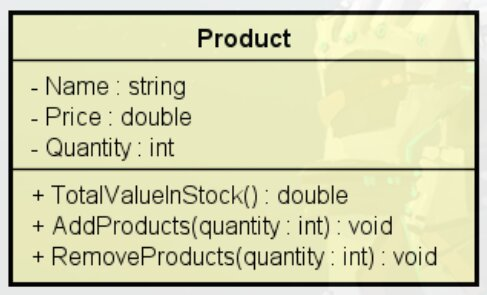

# Resolvendo **sem** orientação a Objeto

Fazer um programa para ler as medidas dos lados de dois triângulos X e Y (suponha medidas válidas). Em seguida, mostrar o valor das áreas dos dois triângulos e dizer qual dos dois triângulos possui a maior área.  
A fórmula para calcular a área de um triângulo a partir das medidas de seus lados a, b e c é a
seguinte (fórmula de Heron)
```java
package application;

import java.util.Locale;
import java.util.Scanner;

public class Program {
    public static void main(String[] args) {
        Locale.setDefault(Locale.US);
        Scanner sc = new Scanner(System.in);
        double xA, xB, xC, yA, yB, yC;
        System.out.println("Enter the measures of triangle X: ");
        xA = sc.nextDouble();
        xB = sc.nextDouble();
        xC = sc.nextDouble();
        System.out.println("Enter the measures of triangle Y: ");
        yA = sc.nextDouble();
        yB = sc.nextDouble();
        yC = sc.nextDouble();
        double p = (xA + xB + xC) / 2.0;
        double areaX = Math.sqrt(p * (p - xA) * (p - xB) * (p - xC));
        p = (yA + yB + yC) / 2.0;
        double areaY = Math.sqrt(p * (p - yA) * (p - yB) * (p - yC));
        System.out.printf("Triangle X area: %.4f%n", areaX);
        System.out.printf("Triangle Y area: %.4f%n", areaY);
        if (areaX > areaY) {
            System.out.println("Larger area: X");
        }
        else {
            System.out.println("Larger area: Y");
        }
        sc.close();
    }
}
```

# Classe

- E um tipo estruturado que **pode conter membros** onde esses membros podem ser **Atributos (Dados / Campos)** ou Métodos **(Funções / Operações)**
- A classe **também pode prover** muitos **outros recursos**, tais como:
    - Construtores
    - Sobrecarga
    - Encapsulamento
    - Herança
    - Polimorfismo

## Exemplos
- Entidades: Produtos, Cliente, Triangulo
- Serviços: ProdutoService, ClienteService, EmailService, StorageService
- Controladores: ProdutoController, ClienteController
- Utilitários: Calculadora, Compactador
- Outros (Views, repositórios, gerenciadores, etc.)

> **Retomada do problema:**  
    > Com 3 atributos para representar melhor o triangulo, pois no solução anterior usamos 3 variáveis para referenciar do mesmo triangulo, ou seja, para melhorar isso, vamos usar uma **Classe** para representar um triangulo.
``` Java
package entities;

public class Triangle {
    public double a;
    public double b;
    public double c;
}
```
Nossa classe `Triangle` possui apenas **Atributos**, com seu tipo sendo `double` e sao *public*, ou seja, esses atributos podem ser acessados por outro arquivo.  
Esta dentro do *package* `entities` pois estamos considerando o triangulo uma entidade do nosso negocio.  

## Mudanca na memoria


Antes tínhamos 3 variáveis para representar os lados de cada triangulo.  
Agora vamos declara os dois triângulos do tipo triangulo, ou seja, `triangle` e um tipo como `double` porem ele e um **tipo composto**, pois tem 3 atributos, assim a variavel vai apontar para um objeto, e esse objeto e composto com 3 atributos.

## Solução
```java
// Em outro arquivo dentro de outro pacote.
package entities;

public class Triangle {
    public double a;
    public double b;
    public double c;
}

// Nosso programa dentro do pacote applications
package application;

import java.util.Locale;
import java.util.Scanner;
import entities.Triangle;

public class Program {
    public static void main(String[] args) {
        Locale.setDefault(Locale.US);
        Scanner sc = new Scanner(System.in);
        Triangle x, y;
        x = new Triangle();
        y = new Triangle();
        System.out.println("Enter the measures of triangle X: ");
        x.a = sc.nextDouble();
        x.b = sc.nextDouble();
        x.c = sc.nextDouble();
        System.out.println("Enter the measures of triangle Y: ");
        y.a = sc.nextDouble();
        y.b = sc.nextDouble();
        y.c = sc.nextDouble();
        double p = (x.a + x.b + x.c) / 2.0;
        double areaX = Math.sqrt(p * (p - x.a) * (p - x.b) * (p - x.c));
        p = (y.a + y.b + y.c) / 2.0;
        double areaY = Math.sqrt(p * (p - y.a) * (p - y.b) * (p - y.c));
        System.out.printf("Triangle X area: %.4f%n", areaX);
        System.out.printf("Triangle Y area: %.4f%n", areaY);
        if (areaX > areaY) {
            System.out.println("Larger area: X");
        }
        else {
            System.out.println("Larger area: Y");
        }
        sc.close();
    }
}
```

## Instanciação

Quando criamos as variáveis com os tipos comuns como no problema anterior `double areaX, areaY, p;` ficam criadas em uma area da memoria chamada *Stack* (Estáticas).    
(Alocação dinâmica de Memoria) Ja quando criamos do tipo `Triangle` ela ficara armazenada no *Heap*, ela ira existir dentro do *Stack* porem la tera um **endereço de memoria**, com este enderece levando ao objeto que foi criado no *Heap*.

```java
package entities;

public class Triangle {
    public double a;
    public double b;
    public double c;
}
```

- Classe - Simplesmente a definição, (`Triangle`)
- Atributos - `a`, `b`, `c`
- Objeto - Criados usando a Classe o `Triangle` x e o y, ou seja, **Instancias** da classe.

# Método

Com método obtemos os benefícios de reaproveitamento e delegação.

Vamos passar a responsabilidade de calcular a area do triangulo, para o próprio, ou seja, dentro da `class Triangle`.
```java
// Dentro da classe Triangle dentro do pacote entities
package entities;

public class Triangle {
    public double a;
    public double b;
    public double c;

    // Função nao recebe parâmetros pois os dados que ela recebe ja se encontra dentro da classe.
    public double area() {
        double p = (a + b + c) / 2.0;
        // Forma mais longo
        double result = Math.sqrt(p * (p - a) * (p - b) * (p - c ));
        return result;
        // Forma mais curta
        return Math.sqrt(p * (p - a) * (p - b) * (p - c ));
    }
}
```

## Resultado no programa.
```java
// Em outro arquivo dentro de outro pacote.
package entities;

public class Triangle {
    public double a;
    public double b;
    public double c;

    public double area() {
        double p = (a + b + c) / 2.0;
        return Math.sqrt(p * (p - a) * (p - b) * (p - c ));
    }
}

// Nosso programa dentro do pacote applications
package application;

import java.util.Locale;
import java.util.Scanner;
import entities.Triangle;

public class Program {
    public static void main(String[] args) {
        Locale.setDefault(Locale.US);
        Scanner sc = new Scanner(System.in);
        Triangle x, y;
        x = new Triangle();
        y = new Triangle();

        System.out.println("Enter the measures of triangle X: ");
        x.a = sc.nextDouble();
        x.b = sc.nextDouble();
        x.c = sc.nextDouble();
        System.out.println("Enter the measures of triangle Y: ");
        y.a = sc.nextDouble();
        y.b = sc.nextDouble();
        y.c = sc.nextDouble();

        double areaX = x.area();
        double areaY = y.area();
        
        System.out.printf("Triangle X area: %.4f%n", areaX);
        System.out.printf("Triangle Y area: %.4f%n", areaY);
        if (areaX > areaY) {
            System.out.println("Larger area: X");
        }
        else {
            System.out.println("Larger area: Y");
        }
        sc.close();
    }
}
```

# Detalhando Classe *Triangle*
```java
package entities;           // Pacote da classe

public class Triangle {     // Classe
    public double a;        // Atributo da Classe
    public double b;        // Atributo da Classe
    public double c;        // Atributo da Classe

    public double area() {  // Metodo da Classe
        double p = (a + b + c) / 2.0;
        return Math.sqrt(p * (p - a) * (p - b) * (p - c ));
    }
}
```

- **`public`** - Prefixo que indica que o atributo ou método pode ser usado em outros arquivos.
- **`double` no método** - Tipo de dado que o método retorno (Se o método nao retorna nada usar a palavra `void`)

# Projeto da Classe
Diagrama da linguagem ***UML***, servi para representar classes e as relações entre elas.


# Exemplo de problema
Fazer um programa para ler os dados de um produto em estoque (nome, preço e quantidade no estoque). Em seguida:  
- Mostrar os dados do produto (nome, preço, quantidade no estoque, valor total no
estoque)
- Realizar uma entrada no estoque e mostrar novamente os dados do produto
- Realizar uma saída no estoque e mostrar novamente os dados do produto  
Para resolver este problema, você deve criar uma CLASSE conforme projeto ao lado:  


# `this`

Palavra reservada que significa uma auto referencia para o objeto 
```java
	public void addProducts(int quantity) {
		this.quantity += quantity
    }
```
`this.quantity` - Esta se referindo ao atributo da Classe, nao ao parâmetro da função 
`quantity` - Referencia ai parâmetro.

# Object e toString

**Toda classe em Java e uma Subclasse da classe *Object*.**

*Object* possui os seguintes métodos
- `getClass` - Retorna o tipo de objeto
- `equals` - Compara se o objeto e igual a outro
- `hashCode` - Retorna um código hash do objeto
- `toString` - Converte o objeto para string

Quando usamos `print` em um objeto, ele automaticamente ia buscar pelo método `toString`, podemos sobrepor o `toString` padrão criando outro na nossa classe.

# Exercícios de Fixação: [Slides 15 e 16](../slides/03-classes-atributos-membros-staticos.pdf)