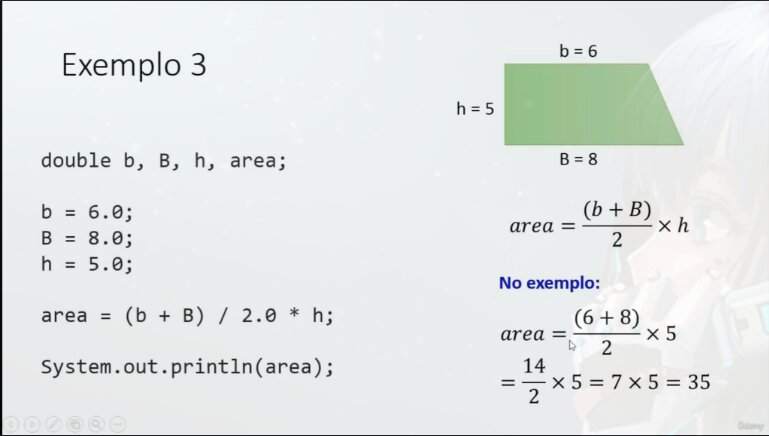

# Processamento de Dados

O processamento de dados em **Todas a Linguagens** e dado através do comando de atribuição (=)

## Sintaxe
```java
<variavel> = <expressão>;
// "=" sendo o Comando de Atribuição
```

### Regra:  
1. A **expressão** e **calculada**
2. O resultado da **expressão** e **armazenado** na variável

## Exemplo 1
```java
int x, y;

x = 5;
y = 2 * x;

System.out.println(x);
// resultado: 5
System.out.println(y);
// resultado: 10
```

# Exemplo 2
```java
int x;
double y;

x = 5;
y = 2 * x;

System.out.println(x);
// resultado: 5
System.out.println(y);
// resultado: 10.0
```
> Imprime o resultado 10.0 pois o inteiro com um ponto flutuante e convertido para ponto flutuante

# Exemplo 3

```java
double b, B, h, area;

b = 6.0;
B = 8.0;
h = 5.0;

area = (b+ B) / 2.0 * h;

System.out.println(area);
// resultado: 35
```
> Boa pratica: Sempre indique o tipo do numero, se a expressao for de ponto flutuante (Nao inteira).  


`duble` use: `.0`  
`float` use: 'f'  

```java
float b, B, h, area;

b = 6f;
B = 8f;
h = 5f;

area = (b + B) / 2f * h;

System.out.println(area);
// resultado: 35.0
```

# Exemplo 4 

```java
int a, b;
double resultado;

a = 5;
b = 2;

resultado = a / b;

System.out.println(resultado);
// resultado: 2.0 (Ou seja, Errado)
```
> Acontece este erro pois o compilador entende que estamos dividindo dois números **Inteiros** assim acreditando que o resultado sera um numero inteiro, para **avisar** que o resultado sera um `double` e necessário realizar a seguinte adicção ao código `resultado = (double) a / b;`

# Casting
Conversão explicita dos valores

## Resolvendo problema anterior com casting
```java
int a, b;
double resultado;

a = 5;
b = 2;

resultado = (double) a / b;

System.out.println(resultado);
// resultado: 2.5;
```

## Quando compilador acha que vai perder informação
O compilador acredito que na conversão de `double` para `int`, pode ocorrer perda de informação, pois perdera as casas decimais, com o uso do **casting** informamos que queremos a conversão mesmo assim.
```java
double a;
int b;

a = 5.0;
b = (int) a;

System.out.print(b);
// resultado: 5;
```

