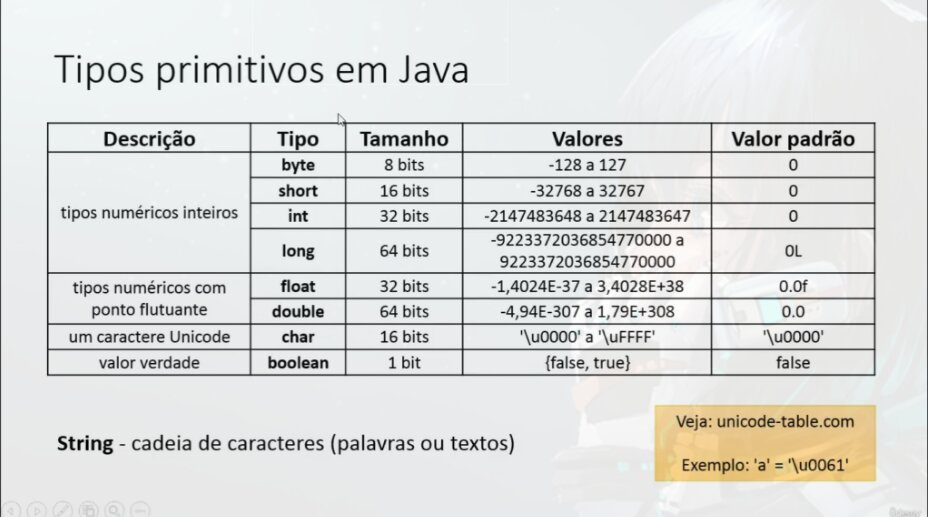
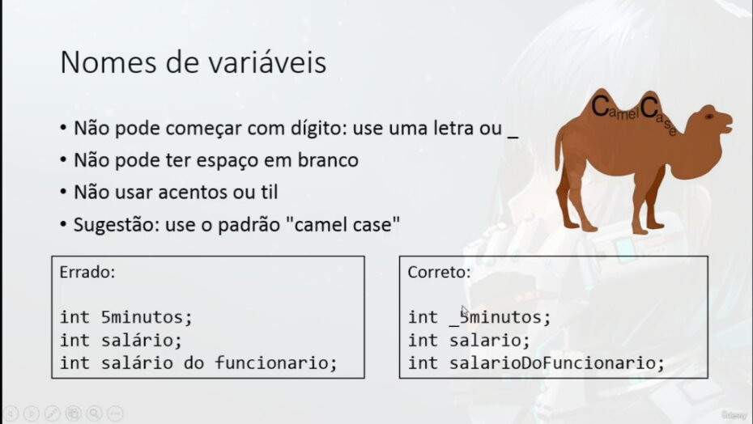

# Declaração de variáveis

Sintaxe:  
`<tipo> <nome> = <valor inicial>;`

Exemplo:  
`int idade = 25;`  
int = Numero Inteiro  
`double altura = 1.68;`  
double = Numero com ponto flutuante  
`char sexo = 'F';`  
char = Um carácter Unicode

# Varinel Possui
- Nome (ou identificador)
- Tipo
- Valor
- Endereço

# Tipos Primitivos em Java

O **tamanho**, ou seja, quantidade de bits representa o numero de valores possíveis diferentes que uma variavel pode armazenar  
1 bit pode armazenar 2 valores possíveis (0 ou 1)  
Cada bit = 2 Possibilidades  
8 bits: 2**8 = 256 possibilidades

# Boas praticas para nomear variáveis

Assim como o javascript utilizar o padrão *camelCase*
