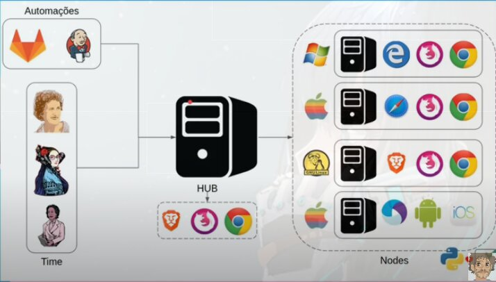

# O que e selenium?

Selenium e uma **biblioteca**, de **software livre**, sob a licença **Apache 2.0**, que te ajuda resolver trabalhos manuais e repetitivos usando o **browser**

O projeto nasceu em 2004 com a ideia de "usar" browsers como um usuário faria.
- Simples e conciso
- E compatível com a maioria dos browsers
- E a recomendação da W3C (World Wide Web Consortium)

# Historio do Selenium

Criado por ***Jason Huggins***, em 2004 para testar aplicações de T&E criada em *Python* e *Plone*  
Eles estavam tendo vários problemas por adicionar Javascript nos projetos.  
O primeiro nome do projeto foi *JavaScriptTestRunner*
A ferramenta se tornou Livre no mesmo ano da criação  

Em 2006, no japão, ***Shinya Kasatani***, se interessou pelo projeto e criou o **Selenium-IDE**.  
Uma extensão para o firefox (Hoje encontrada para chrome também)

***Simon Stewart***, em 2007 nos laboratórios da *ThoughWorks*. Melhorou a maneira de interação do selenium com os navegadores  
Assim nasceu a versão 2.0 e o **Selenium Webdriver**.
Ele separou o navegador no código, criando uma camada intermediara que recebe o código e executa no navegador.  
Assim possibilitando o porte do Selenium para todas as linguagem além do javascript.

Em 2008, ***Philippe Hanrigou***, também na *ThoughtWorks*, criou o **Selenium GRID**  
Uma solução capaz de paralelizar testes, abrindo vários navegadores, e distanciou a execução na maquina local, podendo rodar o teste em outra maquina em outro lugar hospedado.  

# Curiosidade sobre o nome

Depois de alguns anos, foi criado uma ferramenta concorrente chamada "Mercury" (Mercúrio)  
Como piada eles apelidaram o *JavaScriptTestRunner* para Selenium, pois Selenium (Selênio) e usado para curar envenenamento por mercúrio

# Selenium IDE

**Plugin para navegadores**, ótimo para quem nao sabe programar pois ele pode mapear suas acoes do navegador e salvar e reexecutar

# Selenium WebDriver

Inicia uma especie de servidor web localmente na maquina, que recebera o código e executara no navegador.

# Selenium Grid

A principal ideia e par teste, rodando o mesmo teste em vários navegadores e sistemas diferentes ao mesmo tempo.
